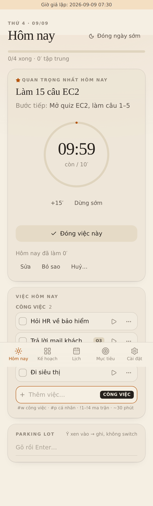
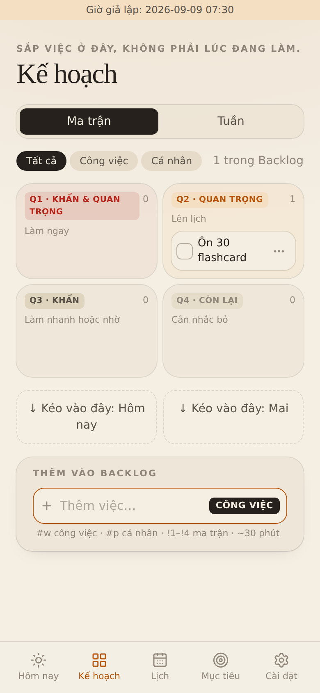
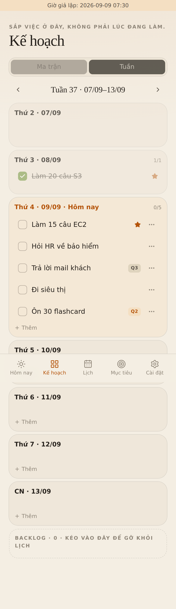
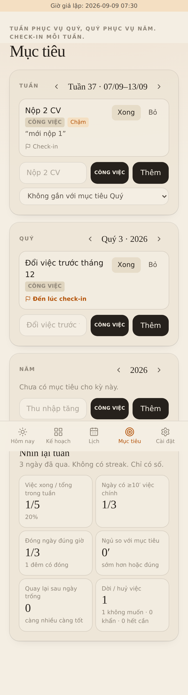
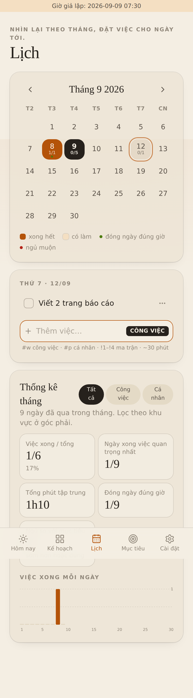
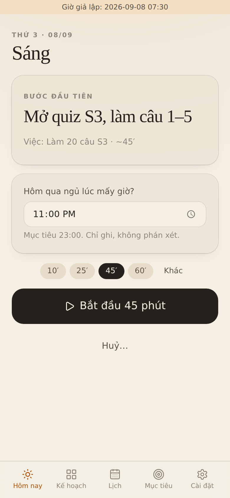
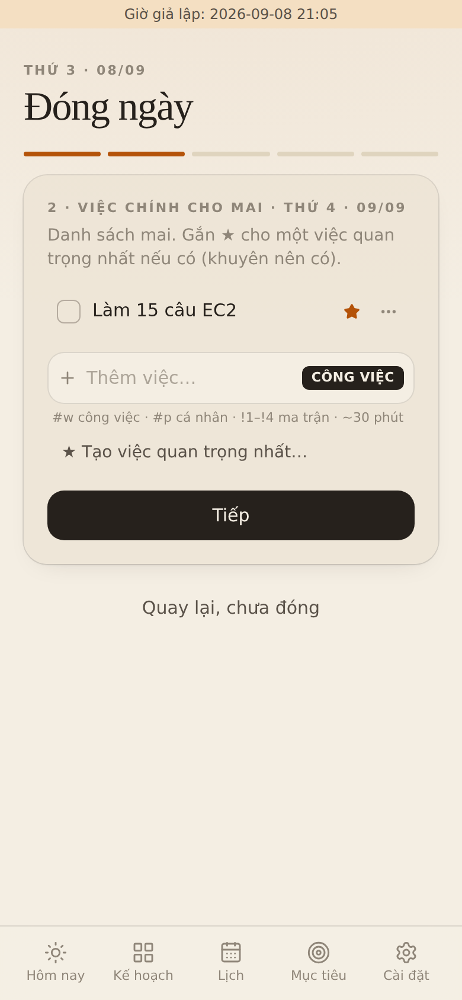
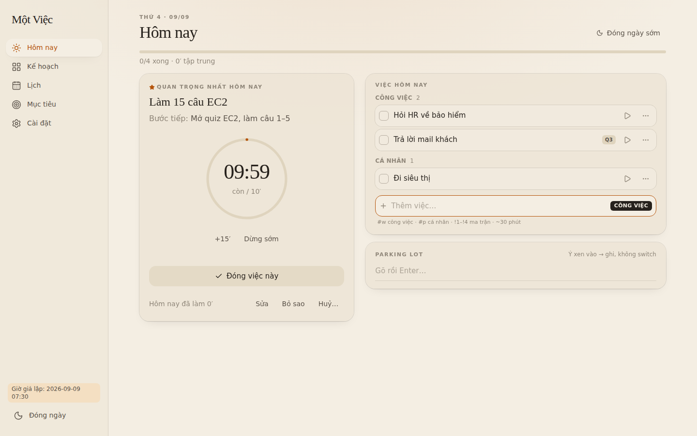
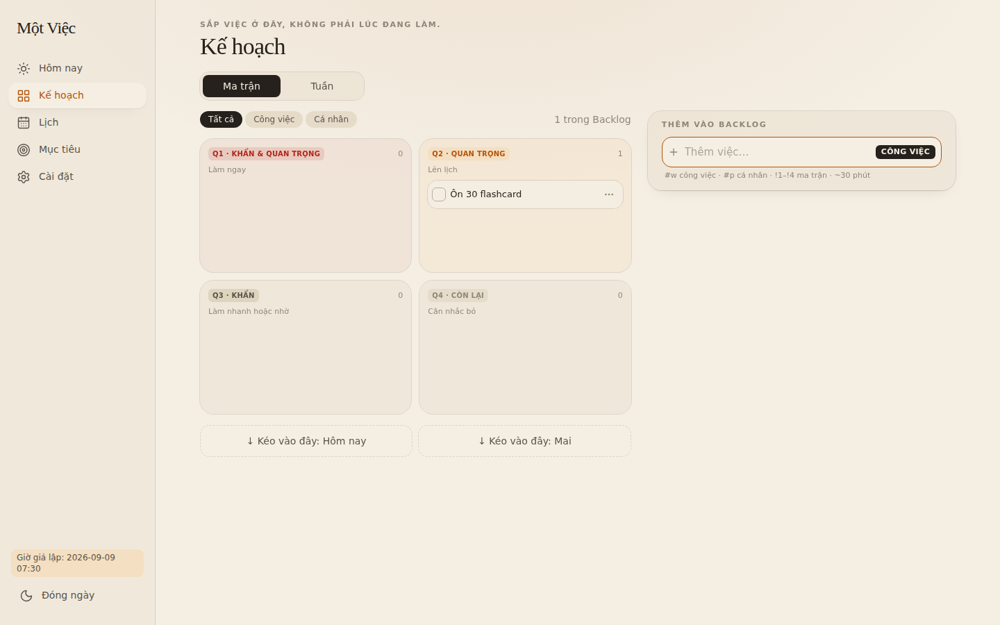
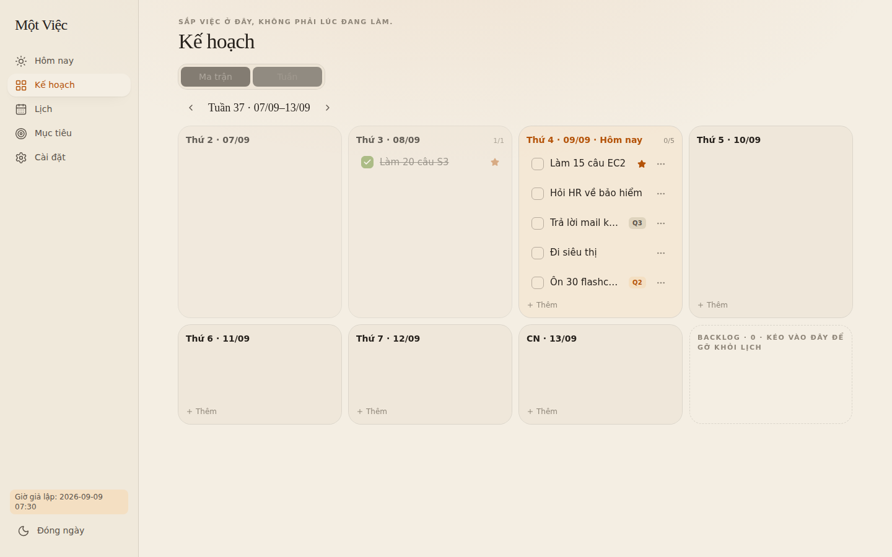

# Một Việc · One Task

Hệ quản lý cá nhân local-first: **mọi đầu việc trong ngày (Công việc / Cá nhân), Backlog theo ma trận Eisenhower, mục tiêu tuần / quý / năm có check-in, lịch và thống kê tháng**.
Bên trong vẫn giữ lớp chống trì hoãn của bản đầu: mỗi ngày có thể gắn ★ một **việc quan trọng nhất (MIT)** với timer chọn được thời lượng (mặc định 10 phút), câu hậu quả tự viết, huỷ có ma sát; **đóng ngày** 5 bước và **night mode** khoá tới sáng.
PWA cài lên điện thoại, tiếng Việt / English, đồng bộ cloud tuỳ chọn qua Supabase free.

Tài liệu: [01 · nghiên cứu](docs/01-research.md) · [02 · brainstorm](docs/02-brainstorm.md) · [03 · plan](docs/03-plan.md) · [parking lot của dự án](docs/parking-lot.md)

| Hôm nay | Kế hoạch · Ma trận | Kế hoạch · Tuần | Mục tiêu |
|---|---|---|---|
|  |  |  |  |

| Lịch + thống kê | Sáng (MIT) | Đóng ngày | Night mode (dark) |
|---|---|---|---|
|  |  |  |  |

Trên màn rộng (≥1024px) điều hướng chuyển sang sidebar trái và mỗi tab chia cột để dùng hết bề ngang:

| Hôm nay | Kế hoạch · Ma trận | Kế hoạch · Tuần |
|---|---|---|
|  |  |  |

## Năm tab

1. **Hôm nay**: MIT (nếu có) với timer đếm ngược, DoD, hậu quả, Huỷ…; danh sách việc trong ngày nhóm Công việc / Cá nhân, kéo thả sắp thứ tự, ▶ tập trung cho bất kỳ việc nào (chọn 10 / 25 / 45 / 60 phút, ước lượng của việc, hoặc nhập số khác; app nhớ lần chọn cuối), thêm nhanh `Trả lời mail #w !3 ~20`, thanh tiến độ, Parking Lot ghi nhanh. Đang chạy có nút +15; hết giờ app hỏi "thêm 15?"; tập trung liền 25 phút thì gợi ý nghỉ 5.
2. **Kế hoạch**: *Ma trận* Eisenhower cho Backlog (kéo giữa 4 ô, kéo vào "Hôm nay"/"Mai" để lên lịch), *Inbox* từ Parking Lot (kéo vào ô hoặc chạm Q1–Q4 để thành việc), bộ lọc khu vực, nhắc khi Backlog quá 30. *Tuần*: 7 ngày xếp dọc, kéo việc giữa ngày hoặc về Backlog.
3. **Lịch**: ô ngày hiện xong/tổng, xong hết tô đậm, chấm xanh đóng ngày đúng giờ, chấm đỏ ngủ muộn. Chạm ngày quá khứ xem việc + phút tập trung + giờ đóng + giờ ngủ; ngày tới thêm việc ngay. Bên dưới: thống kê tháng (lọc khu vực) và biểu đồ cột việc xong mỗi ngày.
4. **Mục tiêu**: Tuần ▸ Quý ▸ Năm, gắn mục tiêu con vào mục tiêu cha, đếm việc gắn, **check-in** đúng hướng / chậm / kẹt kèm một dòng ghi chú, nhắc khi quá hạn check-in hoặc quá 3 mục tiêu tuần. Review tuần: việc xong / tổng, ngày có ≥10′ MIT, đóng ngày đúng giờ, ngủ so mục tiêu, số lần quay lại sau ngày trống, số lần dời việc.
5. **Cài đặt**: giờ đóng ngày / ngủ / sáng, phút khởi động và gia hạn, ngưỡng nghỉ, khu vực mặc định, thông báo (âm, rung, hệ thống), ngôn ngữ, tài khoản & đồng bộ, xuất JSON.

## Nghi thức ngày

- **Sáng**: nếu có MIT, một dòng *bước đầu tiên* + chip thời lượng + "Bắt đầu N phút" hoặc "Huỷ…" (đọc lại hậu quả 5 giây). Nếu chưa: danh sách hôm nay để gắn ★ rồi "Vào ngày". Hỏi giờ ngủ hôm qua.
- **Đóng ngày** (mặc định 21:00, có thông báo): (1) rà mọi việc chưa xong: xong / sang mai / về Backlog / bỏ, không được để treo; (2) chốt danh sách mai, gắn ★, gợi ý từ Backlog Q1–Q2; (3) Parking Lot về 0: thành việc hoặc xoá; (4) một lo lắng + một bước tiếp theo; (5) đóng.
- **Night mode**: khoá tới 04:00, chỉ còn ô Parking Lot và tóm tắt ngày mai.

Thông báo (âm ngắn, rung, Notification API qua service worker) khi hết giờ hẹn, hết nghỉ, đến giờ đóng ngày, đến giờ bắt đầu một việc. Chỉ khi app đang mở hoặc chạy nền; không có server push.

## Chạy

```bash
npm install
npm run dev        # http://localhost:5173/
npm test           # Vitest: logic thuần + Dexie trên fake-indexeddb + sync engine với remote giả
npm run build      # tsc + vite build + service worker
```

Giả lập thời gian để xem mọi màn hình (giữ trong tab cho tới khi `?reset-clock`):

```
http://localhost:5173/?d=2026-09-08&t=07:30   # sáng
http://localhost:5173/?d=2026-09-08&t=08:00   # timer hết giờ, gợi ý nghỉ
http://localhost:5173/?d=2026-09-08&t=21:05   # đến giờ đóng ngày
http://localhost:5173/?d=2026-09-09&t=00:30   # vẫn là đêm hôm trước (ngày logic đổi lúc 04:00)
```

Playwright walkthrough (đi hết 2 ngày, chụp light/dark vào `e2e/shots/`):

```bash
npm i -D playwright && npx playwright install chromium
npm run build && npm run preview &          # cổng 4173
node e2e/walkthrough.mjs                    # thêm DARK=1 cho bản tối
```

## Deploy (GitHub Pages, miễn phí)

Push `main` → Actions build + deploy. Bật một lần: **Settings → Pages → Source: GitHub Actions**. Base path lấy theo tên repo: `https://<user>.github.io/<repo>/`. Trên điện thoại: mở URL → "Thêm vào màn hình chính".

## Đồng bộ cloud (tuỳ chọn, Supabase free)

Không cấu hình gì thì app chạy hoàn toàn trong trình duyệt. Muốn dùng trên nhiều máy:

1. Tạo project tại https://supabase.com (free, không cần thẻ). Free project tự tạm dừng sau 7 ngày không dùng; bấm Restore là chạy lại.
2. **SQL Editor** → dán và chạy [`supabase/migrations/0001_records.sql`](supabase/migrations/0001_records.sql) (1 bảng `records` jsonb + Row Level Security theo user).
3. **Authentication → URL Configuration**: Site URL = `https://<user>.github.io/<repo>/`, thêm URL đó vào Redirect URLs. Email provider để mặc định (magic link).
4. **Project Settings → API**: copy `Project URL` và `anon public` key.
5. GitHub repo → **Settings → Secrets and variables → Actions → Variables**: tạo `VITE_SUPABASE_URL` và `VITE_SUPABASE_ANON_KEY`. Push lại (hoặc Re-run workflow).
6. Trong app: **Cài đặt → Tài khoản & đồng bộ** → nhập email → bấm link trong mail.

Local dev: copy `.env.example` → `.env.local` và điền 2 biến. Anon key là public theo thiết kế; dữ liệu được bảo vệ bằng RLS (`auth.uid() = user_id`).

Cách sync hoạt động: mọi ghi vào IndexedDB đều đặt `updatedAt` và xếp vào `outbox`; app đẩy outbox lên `records` và kéo về các dòng mới hơn con trỏ của máy, ai ghi sau thắng. Xoá là xoá mềm. Lần đăng nhập đầu trên một máy, toàn bộ dữ liệu local được đẩy lên để hợp nhất với máy khác.

## Stack

Vite 8 · React 19 · TypeScript · Tailwind 4 (token giấy/mực, dark theo hệ) · Dexie 4 (IndexedDB) · @dnd-kit · lucide-react · @supabase/supabase-js · vite-plugin-pwa · Vitest · Playwright.

```
src/
  i18n/       vi.ts, en.ts, index.ts (t(), fmtDate)
  lib/        dates, clock (giờ giả lập), phase, period (tuần/quý/năm), quickAdd, calendar, metrics,
              notify (âm/rung/Notification), vagueness (gợi ý mềm),
              db (Dexie v4 + put/patch/softDelete + outbox), actions + *.test.ts
  sync/       remote (interface + MemoryRemote), engine (push/pull/LWW), supabase (adapter), index (auth + lịch sync)
  components/ ui, dnd/ (SortableList, DragBoard), TaskRow, TaskSheet, QuickAdd, QuadrantChip, TaskForm, CancelFlow, FocusTimer, ParkingLot, AccountCard
  screens/    Morning, Today, Plan, Calendar, Goals, Shutdown, Night, Settings
  App.tsx     state machine theo ngày logic + nav + nhắc giờ
supabase/migrations/0001_records.sql
```

## Nguyên tắc sản phẩm (v0.3)

1. Một ★ mỗi ngày là tuỳ chọn nhưng được khuyến khích; mọi số liệu "chống trì hoãn" đo trên ★.
2. Sắp việc ở tab Kế hoạch và lúc Đóng ngày, không phải lúc đang làm.
3. Khoá thay cho nhắc: sau Đóng ngày không mở việc mới.
4. Ma sát đúng chỗ: dễ khi bắt đầu, khó khi trốn (hậu quả tự viết), không để việc treo qua đêm.
5. Đo lần quay lại, không đo chuỗi. Không streak.
6. Backlog quá 30, mục tiêu tuần quá 3 → app nhắc dọn, không chặn.
