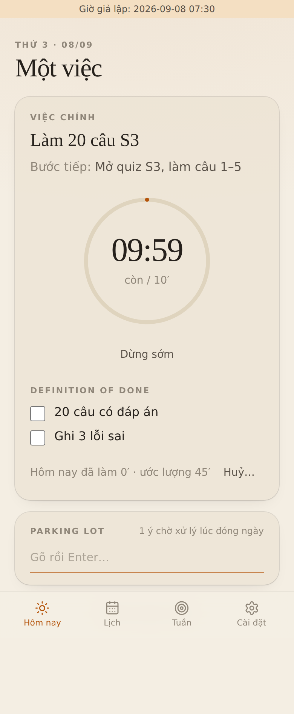
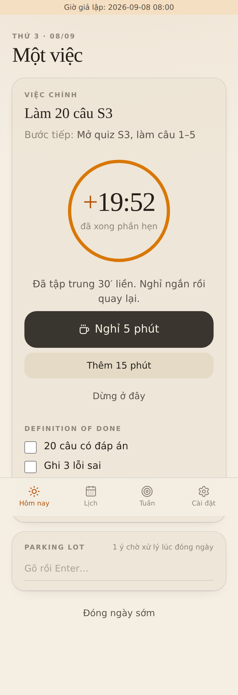
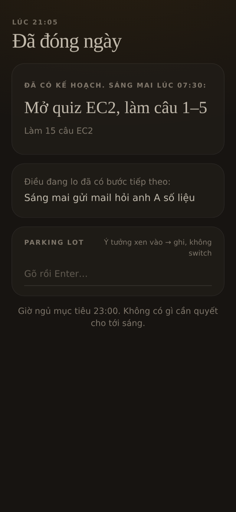
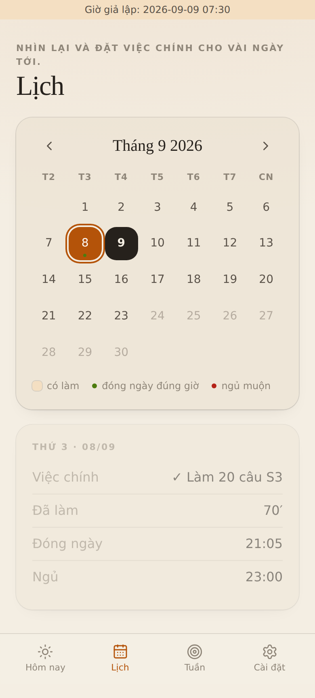
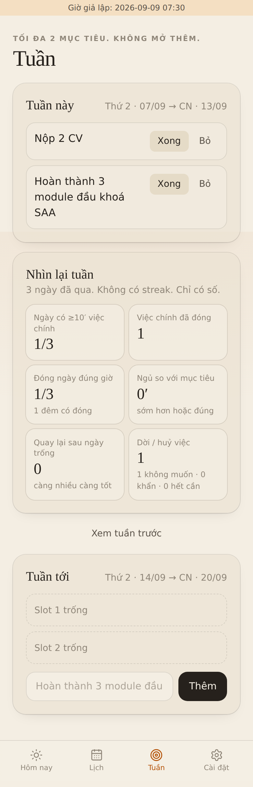
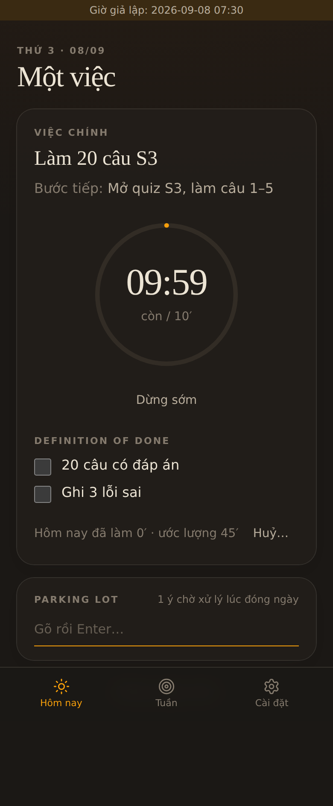

# Một Việc · One Task

Web app cá nhân chống trì hoãn: **một việc chính mỗi ngày, đóng ngày đúng giờ, quay lại khi trượt**.
Local-first, cài được lên điện thoại (PWA), tiếng Việt / English, đồng bộ cloud tuỳ chọn qua Supabase free.

Tài liệu: [01 · nghiên cứu](docs/01-research.md) · [02 · brainstorm](docs/02-brainstorm.md) · [03 · plan](docs/03-plan.md) · [parking lot của dự án](docs/parking-lot.md)

| Sáng | Trong ngày | Gợi ý nghỉ | Night mode |
|---|---|---|---|
|  |  |  |  |

| Lịch (nhìn lại) | Lịch (đặt việc) | Tuần | Dark mode |
|---|---|---|---|
|  |  |  |  |

## Vòng đời một ngày

1. **Sáng**: đúng 1 dòng *bước đầu tiên*, hỏi "hôm qua ngủ lúc mấy giờ". Hai nút: **Bắt đầu 10 phút** hoặc **Huỷ…**. Không list.
2. **Trong ngày**: một việc chính, timer đếm ngược. Hết 10 phút app hỏi "thêm 15?" chứ không hỏi "xong chưa?". Tập trung liền 25 phút thì gợi ý **nghỉ 5 phút** (không bắt buộc, phút nghỉ không tính vào phút làm). Ý tưởng xen vào → **Parking Lot**, Enter, quay lại. Không có nút Hoãn.
3. **Huỷ…**: nếu bạn đã viết *hậu quả*, app hiện lại đúng câu đó và bắt đọc 5 giây, rồi chọn lý do. "Không muốn làm" chỉ có một nút: *Làm 10 phút rồi quyết*.
4. **Đóng ngày** (mặc định 21:00): 5 bước. Việc hôm nay xong chưa → việc chính cho mai → quét Parking Lot về 0 → 1 lo lắng + 1 bước tiếp theo → Đóng.
5. **Night mode**: khoá tới 04:00. Không tạo, không sửa, không xem list. Chỉ còn ô Parking Lot và "Đã có kế hoạch. Sáng mai lúc 07:30: …".
6. **Lịch**: quá khứ chỉ đọc (ô tô màu theo có làm, chấm xanh đóng ngày đúng giờ, chấm đỏ ngủ muộn). Tương lai tối đa **14 ngày**: đặt đúng một việc chính cho ngày đó. Xa hơn: app bảo ghi vào Parking Lot.
7. **Tuần**: tối đa 2 mục tiêu. Review: ngày có ≥10′ việc chính, đóng ngày đúng giờ, ngủ so với mục tiêu, **số lần quay lại sau ngày trống** (không có streak), số lần dời việc.

Tạo việc chỉ cần **tên việc**. Bước đầu tiên, khi nào gọi là xong, hậu quả, ước lượng đều tuỳ chọn, chỉ có gợi ý ngắn. Tên mơ hồ ("Học AWS") được gợi ý nhẹ, không bị chặn.

## Chạy

```bash
npm install
npm run dev        # http://localhost:5173/
npm test           # Vitest: logic thuần + Dexie trên fake-indexeddb + sync engine với remote giả
npm run build      # tsc + vite build + service worker
```

Giả lập thời gian để xem mọi màn hình (giữ trong tab cho tới khi `?reset-clock`):

```
http://localhost:5173/?d=2026-09-08&t=07:30   # sáng
http://localhost:5173/?d=2026-09-08&t=08:00   # timer hết giờ, gợi ý nghỉ
http://localhost:5173/?d=2026-09-08&t=21:05   # đến giờ đóng ngày
http://localhost:5173/?d=2026-09-09&t=00:30   # vẫn là đêm hôm trước (ngày logic đổi lúc 04:00)
```

Playwright walkthrough (đi hết 2 ngày, chụp light/dark vào `e2e/shots/`):

```bash
npm i -D playwright && npx playwright install chromium
npm run build && npm run preview &          # cổng 4173
node e2e/walkthrough.mjs                    # thêm DARK=1 cho bản tối
```

## Deploy (GitHub Pages, miễn phí)

Push `main` → Actions build + deploy. Bật một lần: **Settings → Pages → Source: GitHub Actions**. Base path lấy theo tên repo: `https://<user>.github.io/<repo>/`. Trên điện thoại: mở URL → "Thêm vào màn hình chính".

## Đồng bộ cloud (tuỳ chọn, Supabase free)

Không cấu hình gì thì app chạy hoàn toàn trong trình duyệt. Muốn dùng trên nhiều máy:

1. Tạo project tại https://supabase.com (free, không cần thẻ). Free project tự tạm dừng sau 7 ngày không dùng; bấm Restore là chạy lại.
2. **SQL Editor** → dán và chạy [`supabase/migrations/0001_records.sql`](supabase/migrations/0001_records.sql) (1 bảng `records` jsonb + Row Level Security theo user).
3. **Authentication → URL Configuration**: Site URL = `https://<user>.github.io/<repo>/`, thêm URL đó vào Redirect URLs. Email provider để mặc định (magic link).
4. **Project Settings → API**: copy `Project URL` và `anon public` key.
5. GitHub repo → **Settings → Secrets and variables → Actions → Variables**: tạo `VITE_SUPABASE_URL` và `VITE_SUPABASE_ANON_KEY`. Push lại (hoặc Re-run workflow).
6. Trong app: **Cài đặt → Tài khoản & đồng bộ** → nhập email → bấm link trong mail.

Local dev: copy `.env.example` → `.env.local` và điền 2 biến. Anon key là public theo thiết kế; dữ liệu được bảo vệ bằng RLS (`auth.uid() = user_id`).

Cách sync hoạt động: mọi ghi vào IndexedDB đều đặt `updatedAt` và xếp vào `outbox`; app đẩy outbox lên `records` và kéo về các dòng mới hơn con trỏ của máy, ai ghi sau thắng. Xoá là xoá mềm. Lần đăng nhập đầu trên một máy, toàn bộ dữ liệu local được đẩy lên để hợp nhất với máy khác.

## Stack

Vite 8 · React 19 · TypeScript · Tailwind 4 (token giấy/mực, dark theo hệ) · Dexie 4 (IndexedDB) · lucide-react · @supabase/supabase-js · vite-plugin-pwa · Vitest · Playwright.

```
src/
  i18n/       vi.ts, en.ts, index.ts (t(), fmtDate)
  lib/        dates, clock (giờ giả lập), phase, vagueness (gợi ý mềm), calendar, metrics,
              db (Dexie v3 + put/patch/softDelete + outbox), actions + *.test.ts
  sync/       remote (interface + MemoryRemote), engine (push/pull/LWW), supabase (adapter), index (auth + lịch sync)
  components/ ui, TaskForm, CancelFlow, FocusTimer, ParkingLot, AccountCard
  screens/    Morning, Today, Shutdown, Night, Calendar, Week, Settings
  App.tsx     state machine theo ngày logic + nav
supabase/migrations/0001_records.sql
```

## Nguyên tắc sản phẩm

1. Một màn hình, một việc, một nút.
2. Kế hoạch ra buổi tối, sáng chỉ thực thi.
3. Khoá thay cho nhắc.
4. Ma sát đúng chỗ: dễ khi bắt đầu, khó khi trốn, không thể sau khi đóng ngày.
5. Đo lần quay lại, không đo chuỗi.
6. Nếu một tính năng làm bạn mở app lâu hơn, nó sai.
